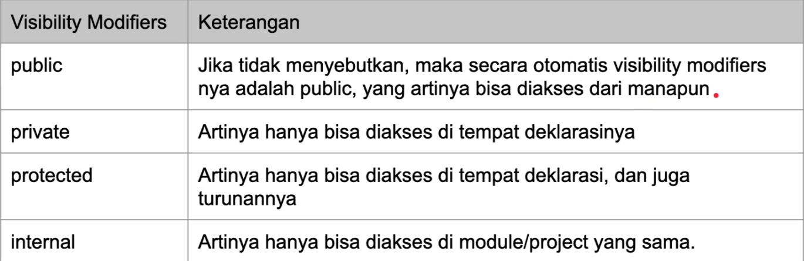

<h2 align="center">Kotlin Object Oriented Programming</h2>

`Note: When an object of the class is created, it has access to all of the class functions.`

**Function Overriding :**

`Function Overriding merupakan sebuah cara dalam inheritance (Pewarisan) dimana sebuah function didalam class parent dapat dirubah didalam class child, dengan kata kunci (open) karena default sebuah function didalam class merupakan final.`

**Final Override Function :**

`Saat kita membuat ulang sebuah function di class child secara default function tersebut ber-Sifat open dimana berarti function tersebut dapat dibuat ulang lagi oleh class child di bawahnya `

`jika tidak ingin function yang dibuat ulang dipakai class child dibawahnya makan harus ditambahkan kata kunci (final) didepan (override)`

**Super Keyword**

`Super keyword sama halnya dengan this yang menyatakan properties di class tersebut, sedangkan keyword super digunakan untuk mengakses function atau properties parent class didalam child class, contohnya {super.(function/properties)}.`

**Super Constructor**

`Sama seperti sebelumnya keyword super juga bisa digunakan pada constructor, dimana ini berguna untuk memanggil atau menggunakan ulang constructor Class Parent kepada Class Child, Namun class child tidak bisa menggunakan primary constructor jika ingin menggunakan super keyword, Jika ingin menggunakan primary constructor maka tidak perlu lagi menggunakan super keyword`

**Any Class**

`Any Class merupakan default parent sebuah class dalam kotlin, Dimana ketika kita membuat class yang tidak memiliki extend (:) maka secara default class tersebut sebuah child dari Any Class (Super Class), dan jika Class Child memiliki Class Prent, Class Parent tersebut juga memilik default parent Any Class.`

**Type Check & Cast**

`Sesuai dengan namanya Type Check & Cast Metode ini digunakan untuk meng-check Type data dan meng-Konversi ke tipe data lainnya secara generik menggukan tipe data Any.`

**Unsafe Cast**

`Kotlin juga mendukung konversi tipe data secara paksa menggunakan keyword (as), Namun metode ini tidak aman jika tipe data-nya ternyata tidak sesuai.`

**Safe Nullable Cast**

`Namun kotlin juga dapat mengganti paksa tipe data dengan aman menggunakan metode nullable dimana keyword yang di gunakan adalah "as?" ketika hasil yang dikeluarkan tidak sesuai dengan tipe data yang di inginkan maka tidak akan terjadi error, tetapi akan null.(More Safe)`

**toString() Function**

`toSting() merupakan salah satu funtion yang dimiliki oleh superclass Any, toString merupakan representasi String dari object, Standarnya toString() akan mengembalikan referensi kode unik ketika kita lakukan println, kita bisa meng-Override function toString() jika ingin mengubah representasi dari String pada object yang kita miliki`

**equals Function**

`Di kotlin, Semua object bisa dibandingkan menggunakan operasi "==" atau "!=", Saat membandingkan objek menggunakan operasi tersebut sebenarnya koltin akan menggunkan function equals() milik class super Any, Untuk mengubah cara membandingkannya kita bisa meng-override equals milik class Any.`

**hasCode Function**

`hashCode merupakan function yang dimiliki oleh super class Any, dimana funtion tersebut digunakan untuk meng-representasikan number sebuah object, Salah satu penggunaan yang banyak digunakan adalah di struktur data, misal untuk memastikan tidak ada data yang di duplicate,agar lebih mudah cek di nilai hashCode-nya, Jika hashCode sama maka objectnya dianggap sama.` 

**Abstract Class**

`Abstract Class merupakan class yang dibuat untuk diturunkan untuk class lain, ketika membuat class abstract kita tidak perlu men-definisikan kelas tersebut open karena secara langsung abstract menjadi open atau bisa diturunkan langsung kekelas lainya.`

**Abstract Properties & Function**

`Abstract Properties & Function merupakan Properties dan Function yang wajib di override ke class child dimana Abstract Properties dan Function tidak perlu di-insialisasikan value dan blok kode-nya diwajibkan hanya di subclass atau class child-nya`

**Getter & Setter**

`Getter adalah function yang dibuat untuk mengambil data properties sedangkan Setter adalah function yang dibuat untuk mengubah data properties.
Getter dan Setter tidak wajib dideklarasikan semua dalam kotlin, Kita bisa hanya mendeklarasikan salah satunya saja Getter atau Setter.`

**Late-Initialized Properties**

`Setandarnya Properties/Identifier di Kotlin wajib di inisialisasi-kan diawal saat di deklarasikan, Namun didalam Kotlin kita bisa menunda inisialisasi data para properties/identifier dengan menggunkan kata kunci ( lateinit ), Dan kata kunci tersebut hanya dapat digunakan pada var.`

**Interface**

`Interface merupakan sebuah blueprint Sama tapi tak serupa dengan Class, Interface lebih mirip dengan Class Abstrak karena Interface tidak perlu menginisialisasikan properties dan function didalamnya tanpa harus menuliskan kata abstract, Di interface juga kita bisa membuat concrete yang artinya bisa tidak membuat function tersebut di Class Child, default function dari interface juga secara langsung open, di Interface juga bisa melakukan Multiple inheritance dimana class child bisa memiliki banyak parent Interface, INterface juga bisa inheritance antar Interface`

**Visibility Modifiers**

`Sesuai dengan namanya "Visibility" jarak pandang dan "Modifiers" pengubah, mungkind dari awal ketika mempelajari java atau kotlin tidak asing dengan visibility modifiers namun belum mengetahui maksudnya, gambar dibawah penjelasan detail tentang visibility modifiers`

**Extensions Function**

`Extensions Function merupakan sebuah metode untuk melanjutkan atau menambahkan data yang sudah ada menggunakan function, extension function juga bisa nullable safe hanya dengan ditambahkan (?) pada code. Extention bukanlah Function di Class, kita tidak menambahkan atau mengedit function didalam class yang artinya kita tidak dapat meng-akses private dan protected visibility modifier.`